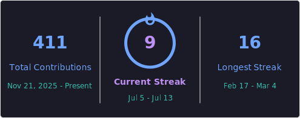

<!-- Header Banner -->
<div align="center">

```
██╗  ██╗██╗██████╗ ██████╗ ███████╗███╗   ██╗ ██████╗ ██████╗ ███╗   ██╗ ██████╗███████╗██████╗ ████████╗
██║  ██║██║██╔══██╗██╔══██╗██╔════╝████╗  ██║██╔════╝██╔═══██╗████╗  ██║██╔════╝██╔════╝██╔══██╗╚══██╔══╝
███████║██║██║  ██║██║  ██║█████╗  ██╔██╗ ██║██║     ██║   ██║██╔██╗ ██║██║     █████╗  ██████╔╝   ██║   
██╔══██║██║██║  ██║██║  ██║██╔══╝  ██║╚██╗██║██║     ██║   ██║██║╚██╗██║██║     ██╔══╝  ██╔═══╝    ██║   
██║  ██║██║██████╔╝██████╔╝███████╗██║ ╚████║╚██████╗╚██████╔╝██║ ╚████║╚██████╗███████╗██║        ██║   
╚═╝  ╚═╝╚═╝╚═════╝ ╚═════╝ ╚══════╝╚═╝  ╚═══╝ ╚═════╝ ╚═════╝ ╚═╝  ╚═════╝ ╚══════╝╚═╝        ╚═╝   
```


</div>

## `▸ ABOUT_ME.exe`

| | |
|---|---|
| 🧠 **Focus** | Data Analytics • Machine Learning • AI |
| 📊 **Current** | Power Bi Projects & Studying For The Exam |
| 🛠 **Tools** | Python • Power BI • SQL • Excel |
| 🎧 **Vibe** | Data by day \| DJ by night |
| 🌐 **Location** | Online — Signal Always Active |
| 🟣 **Status** | ONLINE — Always Building Something |

## `▸ WHAT_I_BRING.log`

```
  ✔️  Strong analytical thinking & problem-solving
  ✔️  Business-focused dashboard development
  ✔️  Data cleaning & transformation expertise
  ✔️  Clear data storytelling & insight communication
```


## 🛠️ Technical Skill Set

**Languages & Analytics Tools**
- 🐍 Python (Pandas, NumPy, Matplotlib, Seaborn)
- 📊 Power BI (DAX, Power Query, Data Modeling)
- 🗄️ SQL (Data querying, joins, aggregations)
- 📈 Excel (Pivot Tables, Formulas, Dashboards)

---

## `▸ CURRENT_PROJECTS.exe`

```
  🐍  50 Days Of Data Analysis With Python
      Sharpening Python skills for advanced analytics.
      Daily challenges | Real datasets | Pure grind 💪
```

## `▸ FUN_FACTS.json` 🎴

```json
{
  "🎧 DJ / Music"     : "I mix tracks & craft vibes — music is my other language",
  "🌿 Outdoors"       : "Nature resets the system. Hiking, fresh air, clear head.",
  "👨‍👩‍👧 Family"         : "The people that matter most. Always making memories.",
  "🎮 Hidden Trait"   : "Data analyst who sees patterns in everything — even music 🎵"
}
```

## > SYSTEM_STATUS

<div align="center">
<a href="https://git.io/streak-stats"></a>
</div>
<div align="center">


</div>

## `▸ TECH_STACK.json`

<div align="center">


</div>
---

<div align="center">

```
[ SIGNAL ACTIVE ] — hiddenconcept is online and building.
```

</div>
